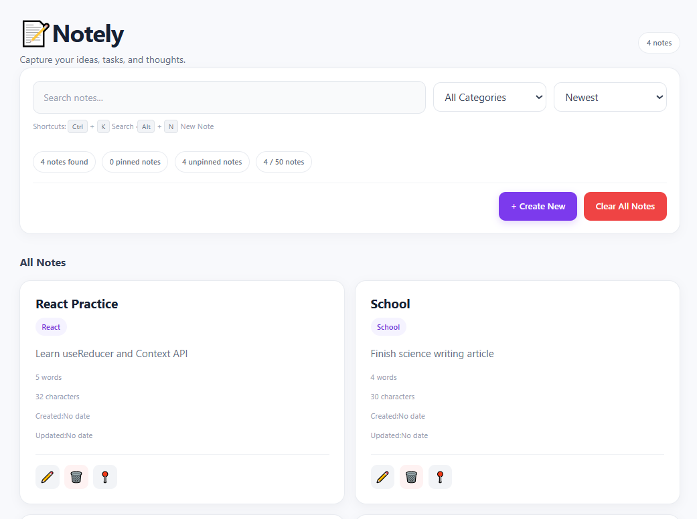

# 📝 Notely

**Every thought has a place.**

Notely is a simple, modern notes app built with React. It helps you organize your thoughts, keep track of ideas, and manage your notes in one place.

🌐 **Live Demo:** [Open Notely](https://melvin-12143031.github.io/Notely/)

## 🖥️ Preview



## ✨ Features

* **Create Notes** — Write and save new notes.
* **Edit Notes** — Update your notes whenever you need to.
* **Delete Notes** — Remove notes you no longer need.
* **Pin Notes** — Keep important notes easy to find.
* **Search Notes** — Quickly find notes using keywords.
* **Filter and Sort** — Organize your notes based on available options.
* **Note Statistics** — Keep track of your notes.
* **Clear All Notes** — Clear your notes with a confirmation dialog.
* **Local Storage** — Keep your notes saved in your browser between visits.
* **Responsive UI** — Use the app on different screen sizes.

## 🛠️ Built With

* React
* JavaScript
* Vite
* CSS
* Browser Local Storage
* Git and GitHub
* GitHub Pages

## 🚀 Getting Started

Want to run Notely on your own computer?

### Prerequisites

Make sure you have [Node.js](https://nodejs.org/) and npm installed.

### Installation

1. Clone the repository:

   ```bash
   git clone https://github.com/Melvin-12143031/Notely.git
   ```

2. Open the project folder:

   ```bash
   cd Notely
   ```

3. Install the dependencies:

   ```bash
   npm install
   ```

4. Start the development server:

   ```bash
   npm run dev
   ```

5. Open the local URL shown in your terminal.

## 📦 Available Scripts

| Command           | Description                                   |
| ----------------- | --------------------------------------------- |
| `npm run dev`     | Starts the development server.                |
| `npm run build`   | Builds the app for production.                |
| `npm run preview` | Previews the production build locally.        |
| `npm run deploy`  | Builds and publishes the app to GitHub Pages. |

## 💾 Data Storage

Notely uses your browser's Local Storage to save notes. Your notes are stored locally in the browser rather than in a remote database.

**Important:** Clearing your browser's site data or switching browsers or devices may remove or make your saved notes unavailable.

## 🎯 Project Goal

Notely was created as a React learning project to practice components, state management, hooks, reusable UI, dialogs, and data persistence.

## 👨‍💻 Author

**Melvin**

Built with React · Made with care ❤️

---

*Every thought has a place.*
